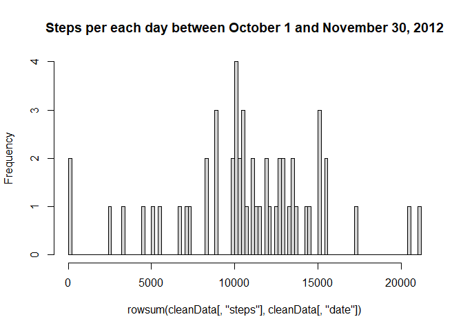
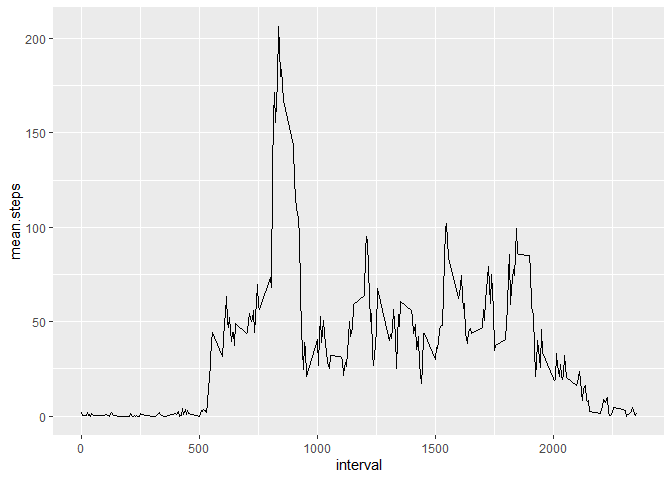
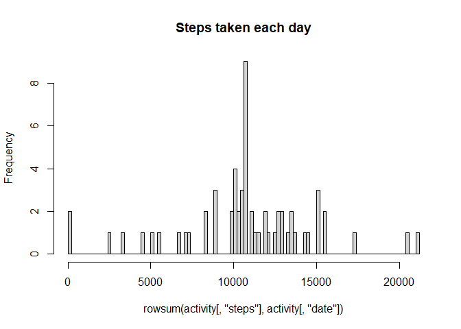
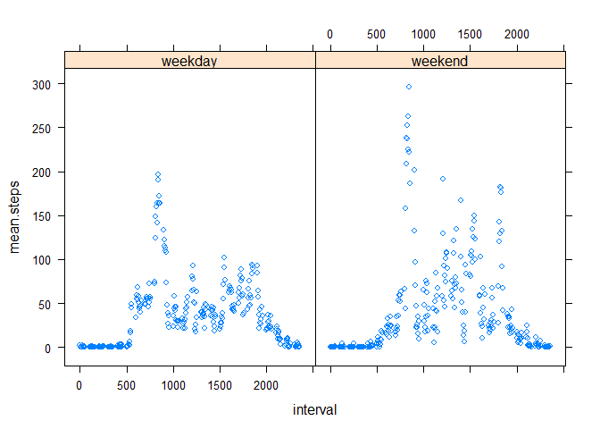

# Reproducible Research Week 2 Activity
##### Javier Quintero Ramírez

#### Load libraries:


```r
library(plyr)
library(ggplot2)
library(lattice)
```


#### If file is not yet unzipped, unzip it:

```r
FileName <- "activity.csv"
zipFileName <- "activity.zip"

if (!file.exists(FileName)) 
{ 
  if (file.exists(zipFileName))
  {
      unzip(zipFileName)   
  }
}
```

#### Get and Clean Main Data

```r
# The nulls values are removed from original data
activity <- read.csv(FileName)
cleanData <- na.omit(activity)
```

### Activity 1 
### What is mean total number of steps taken per day?

```r
hist(rowsum(cleanData[,'steps'], 
            cleanData[,'date']),
            breaks=100,
            main = 'Steps per each day between October 1 and November 30, 2012')
```

<!-- -->

### Answers:

**The steps mean:**

```r
stepsMean <- mean(tapply(cleanData$steps, cleanData$date, sum, na.rm = TRUE))
```
1.0766189\times 10^{4}. 

**The steps median:**

```r
stepsMedian <- median(tapply(cleanData$steps, cleanData$date, sum, na.rm = TRUE))
```
10765.

### Activity 2
## What is the average daily activity pattern?
**Make a time series plot of the 5-minute interval (x-axis) and the average number of steps taken, averaged across all days (y-axis)**

```r
meanStepsByDate <- ddply(cleanData, 
                                      "interval", 
                                      summarise, 
                                      mean.steps = mean(steps))

ggplot(meanStepsByDate) + geom_line(aes(interval, 
                                                     mean.steps)) 
```

<!-- -->

### Answers:
**The steps mean by date:**

```r
meanStepsByDate[which.max(meanStepsByDate[,'mean.steps']),]
```

```
##     interval mean.steps
## 104      835   206.1698
```

## Activity 3
**Calculate and report the total number of missing values in the dataset:**

```r
nrow(activity)-sum(complete.cases(activity))
```

```
## [1] 2304
```

## Imputing missing values

```r
for (i in 1:nrow(activity))  
{
   if (is.na(activity$steps[i])) 
   {
       activity$steps[i] <- meanStepsByDate$mean.steps[meanStepsByDate$interval==activity[i,'interval']]
   }
}

hist(rowsum(activity[,'steps'], 
            activity[,'date']),
            breaks=100,
            main = 'Steps taken each day')
```

<!-- -->


## Activity 4
## Are there differences in activity patterns between weekdays and weekends?
**Create a new factor variable in the dataset with two levels – “weekday” and “weekend” indicating whether a given date is a weekday or weekend day.**

```r
for (i in 1:nrow(activity))  
{
   activity$typeOfDay[i] <- ifelse(weekdays(as.Date(activity$date[i]))<"Saturday","weekday","weekend")
}
activityByTypeDay <- ddply(activity, 
                           .(interval, typeOfDay), 
                           summarise, 
                           mean.steps = mean(steps))

xyplot(mean.steps ~ interval | typeOfDay, data=activityByTypeDay, layout=c(2,1))
```

<!-- -->
